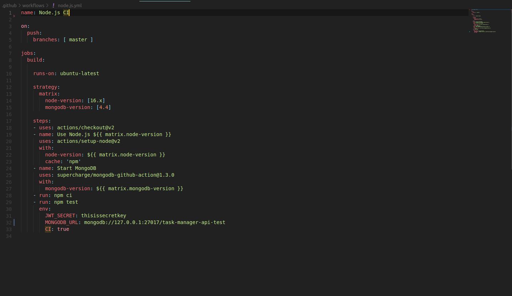
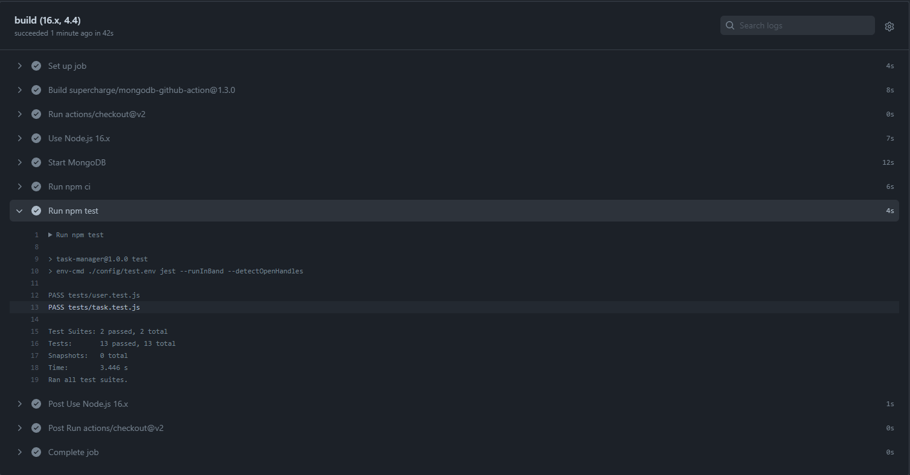
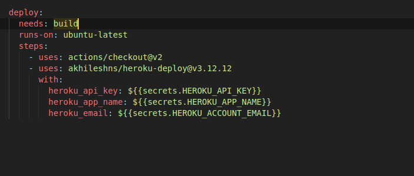
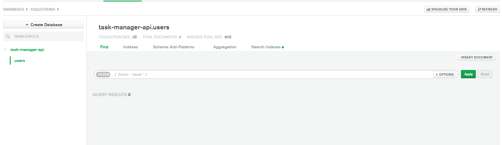
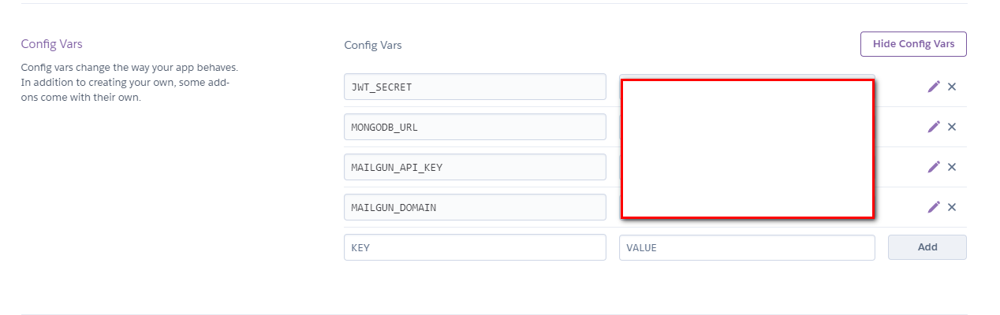
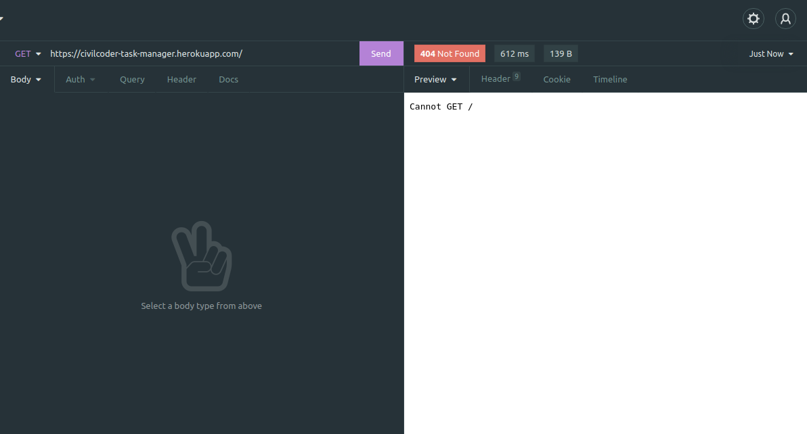
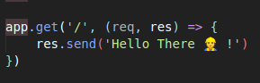
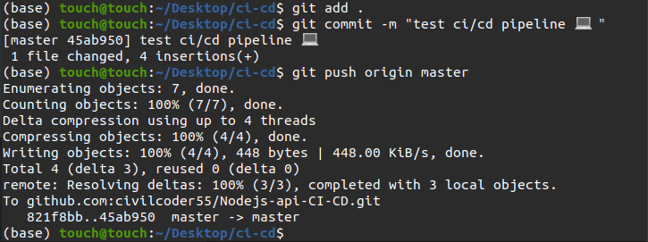
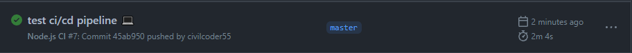
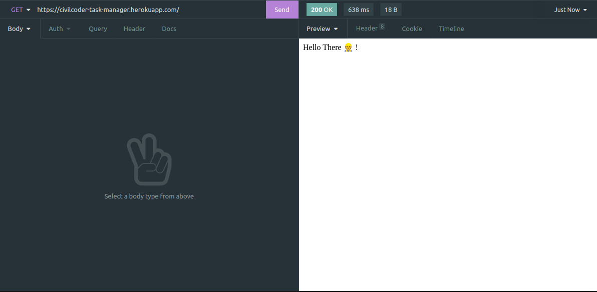

<p align="center">
  
</p>

<p align="center">
  <h3 align="center">Simple Nodejs API app with ci/cd workflows</h3>
  <p align="center"> task manager api written in nodejs </p>
</p>

</br>

## used github actions to make CI/CD pipeline 

</br>

### Usage

1. Clone the repo
    ```sh
    git clone https://github.com/civilcoder55/Nodejs-api-CI-CD.git
    ```

2. Install npm packages
    ```sh
    npm install
    ```

3. Rename config/dev.example.env and config/test.example.env to config/dev.env and config/test.env 
    and add correct variables 

4. to run tests 
    ```sh
    npm run test
    ```

5. to run app 
    ```sh
    npm run dev
    ```

## TO DO

-   [ ] write more test suits .
```
//
// User Test 
//
// Should not signup user with invalid name/email/password
// Should not update user if unauthenticated
// Should not update user with invalid name/email/password
// Should not delete user if unauthenticated

//
// Task Test 
//
// Should not create task with invalid description/completed
// Should not update task with invalid description/completed
// Should delete user task
// Should not delete task if unauthenticated
// Should not update other users task
// Should fetch user task by id
// Should not fetch user task by id if unauthenticated
// Should not fetch other users task by id
// Should fetch only completed tasks
// Should fetch only incomplete tasks
// Should sort tasks by description/completed/createdAt/updatedAt
// Should fetch page of tasks
```

### ci/cd flows


  <h3 align="center" >1- create ci workflow with mongodb actions and adding env variables</h3>
  <p align="center"></p>
  <br>
  <h3 align="center" >2- test ci workflow</h3>
  <p align="center"></p>
  <br>
  <h3 align="center" >3- create cd workflow with heroku deploy action</h3>
  <p align="center"></p>
  <br>
  <h3 align="center" >4- create remote mongodb</h3>
  <p align="center"></p>
  <br>
  <h3 align="center" >5- configure heroku account and adding production env variables</h3>
  <p align="center"></p>
  <br>
  <h3 align="center" >6- lets add home route as development</h3>
  <p align="center"></p>
  <br>
  <p align="center"></p>
  <br>
  <h3 align="center" >7- push code to github repo</h3>
  <p align="center"></p>
  <br>
  <h3 align="center" >8- ci/cd work flow passes ok </h3>
  <p align="center"></p>
  <br>
  <h3 align="center" >9- 🎉 🎊</h3>
  <p align="center"></p>
